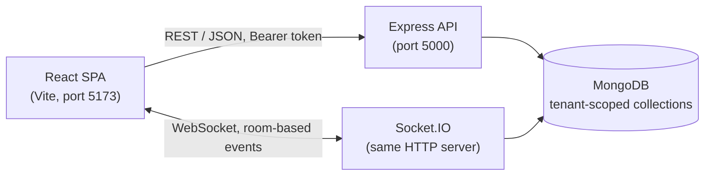
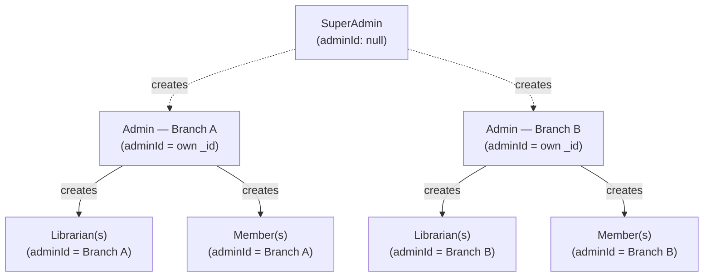
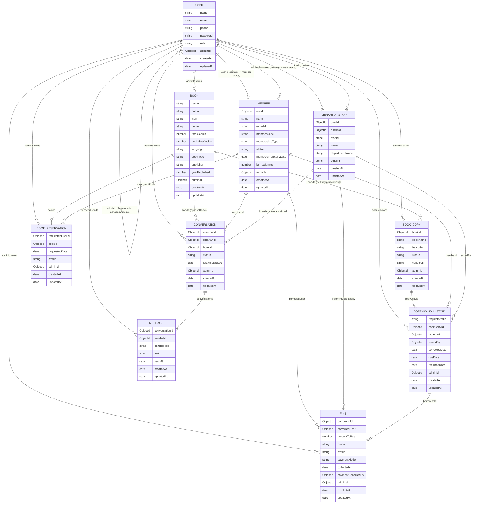
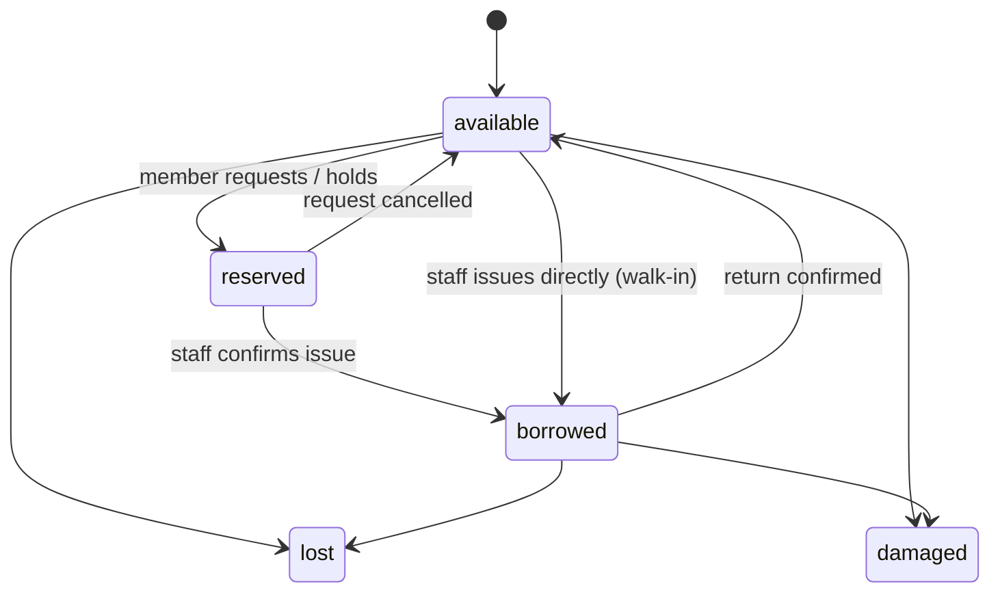
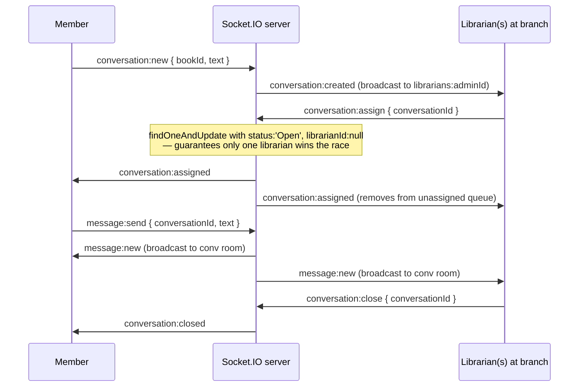

# Stacksmith — System Architecture

## Table of Contents

- [1. Overview](#1-overview)
- [2. Tech Stack](#2-tech-stack)
- [3. High-Level Component Diagram](#3-high-level-component-diagram)
- [4. Multi-Tenancy Model](#4-multi-tenancy-model)
- [5. Roles & Authorization](#5-roles--authorization)
- [6. Data Model](#6-data-model)
- [7. Borrowing Lifecycle](#7-borrowing-lifecycle)
- [8. Real-Time Chat Architecture](#8-real-time-chat-architecture)
- [9. Frontend Structure](#9-frontend-structure)
- [10. Design Decisions & Trade-offs](#10-design-decisions--trade-offs)

## 1. Overview

Stacksmith is a **multi-tenant** library management system: a single deployment serves many independent libraries ("branches"), each with its own admin, librarians, members, catalog, and fines — fully isolated from every other branch's data. On top of that sits a platform-level `SuperAdmin` who can create branches and see cross-tenant analytics.

The system is a standard MERN stack app, extended with Socket.IO for real-time staff/member chat.

## 2. Tech Stack

| Layer | Component | Why |
|---|---|---|
| Frontend | React + Vite | Component-driven SPA with fast dev/build tooling |
| Routing | React Router | Role-gated client-side routing via `ProtectedRoute` |
| Styling | Tailwind CSS + Framer Motion | Utility-first styling with animated transitions |
| Backend | Node.js + Express | REST API layer shared with Socket.IO on one HTTP server |
| Database | MongoDB + Mongoose | Every tenant-scoped collection carries an `adminId`, so isolation is a query filter rather than separate databases |
| Auth | JWT + bcryptjs | Stateless tokens carrying role, tenant (`adminId`), and profile ID in one payload |
| Real-time | Socket.IO | Room-based push messaging for the member/staff chat feature |
| File handling | Multer | Temporary storage for CSV bulk-import uploads |

## 3. High-Level Component Diagram

Express and Socket.IO share a single `http.createServer(app)` instance (see `backend/src/index.js`), rather than running as separate services.

## 4. Multi-Tenancy Model

Every tenant-owned document — `Book`, `BookCopy`, `Member`, `LibrarianStaff`, `BorrowingHistory`, `BookReservation`, `Fine`, `Conversation` — carries an `adminId` field pointing at the branch's `Admin` user. There's no separate "tenant" collection; the `Admin` user *is* the tenant root, and `adminId` on their own `User` document points to their own `_id`.

**Enforcement point — `tenantScope` middleware** (`middlewares/tenant.middleware.js`), applied globally after `auth` in `routes/index.js`:

- For a `SuperAdmin`, it builds an empty filter (sees everything) unless an `adminId` query param narrows it to one branch.
- For everyone else, it locks `req.tenantFilter = { adminId: req.user.adminId }`, rejects any attempt to spoof a different `adminId` in the request body, and auto-injects the caller's own `adminId` into `POST`/`PUT`/`PATCH` bodies so controllers don't have to remember to do it.

Controllers then spread `...(req.tenantFilter || {})` into their Mongoose queries, so a librarian at Branch A can never see or modify Branch B's books, members, or borrowing records — even by guessing IDs.

## 5. Roles & Authorization

Four roles, enforced in layers:

| Role | Scope | Created by |
|---|---|---|
| `SuperAdmin` | Cross-tenant | Self-bootstrapped once via `POST /api/auth/register` (rejected after the first one exists) |
| `Admin` | Owns one branch (their own `adminId`) | `SuperAdmin` via `/api/auth/create-admin` |
| `Librarian` | Scoped to their branch's `adminId` | `Admin` via `/api/auth/create-librarian` |
| `Member` | Scoped to their branch's `adminId` | Staff, via the Members API |

Three cooperating middlewares:

1. **`auth`** — verifies the JWT and attaches the decoded payload (`{ id, role, adminId, profileId }`) to `req.user`.
2. **`authorize(...roles)`** — route-level allow-list; `SuperAdmin` implicitly passes every check.
3. **`requireSelfOrStaff`** — for member self-service endpoints, lets staff through unconditionally, but for a `Member` caller verifies the requested resource actually belongs to their own member profile (with a `skipIdCheck` option for routes where the controller enforces ownership on a different field).

Staff and members authenticate through **separate login endpoints** (`/api/auth/staff-login` vs `/api/auth/member-login`) rather than one shared login, since members log in with a member code instead of an email.

## 6. Data Model

`BookCopy` carries two compound indexes (`{ bookId, status }` and `{ adminId, bookId, status }`) specifically to cover the catalog aggregation used when listing books with live availability counts.

**Note on Identity Uniqueness:** Member email addresses (in the `User` collection) and `memberCode` values are globally unique by design across all tenants. This ensures there are no conflicts during authentication.

## 6.1 Tenant Isolation & Query Guard
While tenant isolation relies on filtering by `adminId`, it is strictly enforced by a Mongoose plugin (`tenantGuardPlugin`). 
- **What it enforces:** Every query (`find`, `findOne`, `aggregate`, etc.) on a tenant-owned model must include an `adminId` filter or explicitly opt out. If the filter is missing, the query throws an error in `enforce` mode (or logs a warning in `warn` mode).
- **Opt-out:** Truly cross-tenant queries (like member login or global uniqueness checks) use `.crossTenant('reason')` to bypass the guard intentionally.
- **Rollout:** The guard was deployed first in `warn` mode to identify and fix missing filters, then switched to `enforce` mode in production to guarantee isolation (fail-closed).

## 7. Borrowing Lifecycle

A book copy moves through a small state machine tracked jointly by `BookCopy.status` and `BorrowingHistory.requestStatus`:

There are two paths to a borrow:

- **Walk-in / direct issue** (`POST /api/borrow/issue`) — staff scans a barcode and a member code at the counter; `BookCopy` goes straight from `available` to `borrowed`.
- **Member self-service request** (`POST /api/borrow/request`) — a member requests a book online; the copy is immediately marked `reserved` and a `BorrowingHistory` record is created with `requestStatus: 'Requested'`. Staff later confirm it via `PATCH /api/borrow/:id/confirm-issue`, which flips the copy to `borrowed` and the record to `Active`.

On return (`POST /api/borrow/return` or `PATCH /api/borrow/:id/confirm-return`), `calculateOverdueFine` (in `utils/fineCalculator.js`) compares `dueDate` against the return timestamp, rounds any partial overdue day up to a full day, and — if the result is greater than zero — creates a `Fine` record with `reason: 'overdue'` at a flat daily rate. `Book.availableCopies` is kept in sync on every issue/return/cancel so catalog browsing always reflects live availability without a separate recount query.

## 8. Real-Time Chat Architecture

Chat is entirely Socket.IO–driven (not REST) for message delivery, with REST endpoints (`/api/chat/*`) used only for initial page-load history.

**Connection & rooms** (`socket/chat.socket.js`):
- A Socket.IO middleware (`io.use`) authenticates the JWT on connect (from the handshake `auth` payload or query string) and loads the caller's `Member` or `LibrarianStaff` profile before allowing the connection.
- Every user joins a personal room (`user:<id>`).
- Every librarian/admin additionally joins a shared per-tenant queue room (`librarians:<adminId>`), so new unassigned conversations broadcast to all available staff at that branch.
- Joining a specific thread puts a socket in `conv:<conversationId>`, scoping message broadcasts to just that conversation's participants.

**Conversation flow:**

Server-side safeguards worth noting:
- **Race-safe claiming** — assignment uses a single atomic `findOneAndUpdate` with the `Open`/`librarianId: null` condition baked into the query, so two librarians clicking "claim" at the same moment can't both win.
- **Ownership checks on every message** — the handler re-fetches the conversation and verifies the sender is either the member who owns it or the librarian assigned to it; the client's claimed role is never trusted.
- **Rate limiting** — an in-memory map caps each socket to 5 messages per 10-second window.
- **Input sanitization** — message text has HTML tags stripped and is truncated to 2000 characters server-side before being persisted or broadcast.
- **Auto-assignment on join** — if a librarian opens an already-open, unclaimed conversation, `conversation:join` assigns it to them automatically so they can reply immediately without a separate claim step.

## 9. Frontend Structure

- **Routing & guarding**: `ProtectedRoute` wraps role-specific route trees, redirecting unauthenticated users to `/login` (preserving the intended destination) and wrong-role users to `/unauthorized`.
- **Dashboards**: separate top-level dashboard components per role (`SuperAdminDashboard`, `AdminDashboard`, `LibrarianDashboard`, `MemberDashboard`), each composing role-appropriate sub-pages.
- **State**: `AuthContext` (session/role/token), `ThemeContext` (light/dark), `DialogContext` (shared modal/confirmation state).
- **API layer** (`services/api.js`): a thin `fetch` wrapper grouped into per-domain objects (`authApi`, `bookApi`, `borrowApi`, `memberApi`, `fineApi`, `chatApi`, `adminApi`, `reportApi`), each attaching the stored Bearer token automatically. CSV upload uses a raw `fetch` with `FormData` since it can't be JSON-encoded.
- **Socket client** (`services/socket.js`): a lazily-created singleton connection authenticated with the same stored JWT, used by the chat UI independently of the REST client.

## 10. Design Decisions & Trade-offs

- **Shared-database multi-tenancy over separate databases per tenant.** An `adminId` filter on every query is far simpler to operate and deploy than provisioning a database per branch. To mitigate the risk of a missed filter causing a cross-tenant data leak, isolation is strictly enforced by the `tenantGuardPlugin` which acts as a safety net to ensure no unscoped query can execute.
- **JWT payload carries `role`, `adminId`, and `profileId` together.** Avoids an extra DB lookup on every request to resolve which branch or profile a user belongs to, at the cost of the token becoming stale if a user's role or branch assignment changes before it expires.
- **Copy status and borrowing status are tracked on two related documents (`BookCopy.status` and `BorrowingHistory.requestStatus`)** rather than one, since a `BookCopy` needs a current status independent of history, while `BorrowingHistory` needs to preserve every past transaction. The trade-off is the two must be kept in sync manually on every transition rather than derived automatically.
- **Socket.IO for chat instead of REST polling.** Enables true real-time delivery and presence-style behavior (join queues, claim races) that would be awkward to build on polling, at the cost of needing a second auth path (the Socket.IO handshake middleware) alongside the REST JWT middleware.
- **Flat-rate overdue fines calculated at return time** rather than accruing daily in the background. Simpler to reason about and implement (no scheduled job needed), at the cost of a member not seeing a running fine total until they actually return the book.

## 11. Smart Search & More Like This
Stacksmith includes a retrieval-only hybrid search capability for the catalog:
- **Hybrid Search:** Combines semantic vector similarity with traditional keyword/ISBN matching. Semantic search embeds the query and compares it in-memory with the branch's book vectors.
- **More Like This:** Recommends similar books by finding nearest neighbor vectors in the same branch.
- **Privacy:** It is retrieval-only (no LLM generation). No member data is sent to the embedding provider—only the book's title, author, genre, and description.
- **Limitations:** The catalog is small enough that in-memory vector comparison is used by default (Atlas Vector Search is optional). Caching, rate limits, and budget caps are currently per-process and would require a shared store like Redis for multi-instance deployments.
- **Message Model Status:** The `Message` model relies on its parent `Conversation` for tenant scoping, which is an intentional design choice given the high volume of messages.
