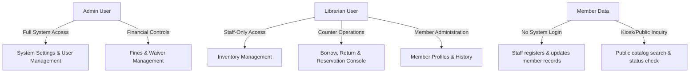
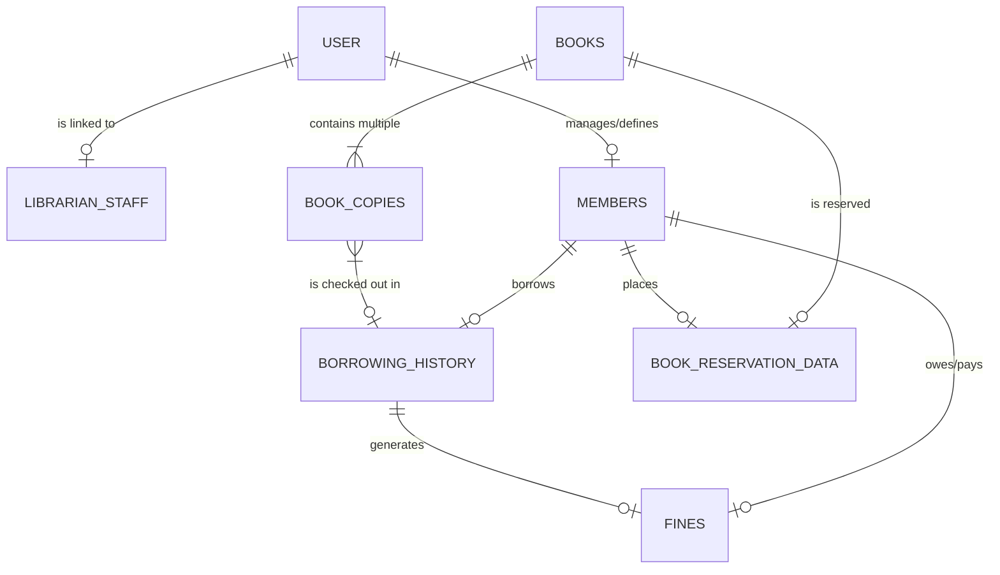
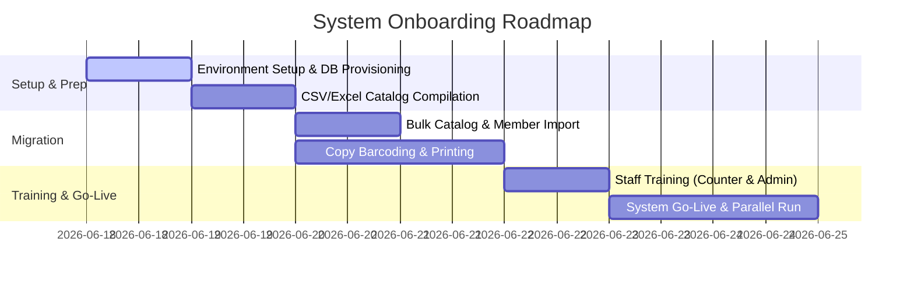

# Library Operations & Inventory Management System
## Client Proposal & System Specifications

---

### Document Overview
* **Document Type**: Client Proposal & System Briefing
* **Version**: v1.0 — June 2026
* **Target Audience**: Library Administrators, Institutional Stakeholders, Development Team
* **Project Status**: Proposal & Technical Architecture Phase
* **Development Stack**: React.js (Frontend), Node.js/Express (Backend), MongoDB/Mongoose (Database)
* **Deployment Model**: On-Premise/Private Cloud, Single-Branch Staff Console (Staff-Only Operations)

---

## 1. Executive Summary & Problem Statement

Modern educational institutions and community libraries face significant operational bottlenecks when relying on manual ledger books, fragmented Excel spreadsheets, or loose WhatsApp groups. These manual systems lead to book shrinkage, lost revenue, administration exhaustion, and zero visibility into inventory value and usage.

### 1.1 The Operational Pain Points
The Library Operations & Inventory Management System is designed to solve several key challenges:

| Pain Point | Impact on Library Operations | System Solution |
| :--- | :--- | :--- |
| **No Real-Time Copy Tracking** | Staff cannot verify if a specific copy of a book is available, borrowed, or lost, leading to long queues at the counter. | Barcode-level status tracking (`Available`, `Borrowed`, `Reserved`, `Lost`, `Damaged`) for every physical book copy. |
| **Manual Fine Calculation** | Late return fines are calculated manually in registers, leading to calculations errors, delays, and disputes with members. | Automatic fine generation based on due-date breaches with built-in audit trails for collection. |
| **Unmonitored Book Damage** | Physical condition deterioration goes unlogged, resulting in poor-quality inventory on shelves. | Copy-specific condition monitoring (`Perfect`, `Okay`, `Poor`) logged at every return. |
| **Inefficient Queue Management** | Hold requests for high-demand books are managed on scrap paper, leading to lost requests or out-of-order lending. | Auto-managed FIFO (First-In, First-Out) digital Reservation Queue. |
| **Zero Usage Analytics** | Administrators have no data on which genres are popular or which members are reading, hindering purchasing decisions. | Live analytics showing the most borrowed books, active readers, and monthly issue trends. |

---

## 2. System Overview & Core Principles

The proposed system is a robust, lightweight, and secure web application built to run in a single-branch configuration. It is designed to be operated entirely by authorized staff members (Admins and Librarians) at the counter or administrative desks, acting on behalf of the members.

### 2.1 Core System Principles

* **Staff-Centric & Secure**: By choosing a **staff-only login model** (no member portals or logins), the system avoids the complexity and security overhead of managing credentials for thousands of student/member accounts. Members request actions at the counter, and staff execute them instantly.
* **Granular Copy-Level Inventory**: Unlike basic catalogs that only track titles, this system tracks every individual physical copy of a book using barcode strings and condition logging.
* **Auditability**: Every transaction—whether issuing a book, collecting a payment, or adding stock—is stamped with the date and the identity of the staff member who performed the action.
* **Log-Only Financials**: To avoid complex gateway integrations, bank fees, and reconciliation delays, payment modes are logged manually at the counter, providing a digitized ledger without external processing dependencies.

---

## 3. System Architecture & User Roles

The application enforces a strict role-based access control (RBAC) model. There are three roles defined within the database, two of which are authenticable staff accounts.



### 3.1 Role & Permission Matrix

| System Capability | Admin (Staff) | Librarian (Staff) | Member (Staff-Operated) |
| :--- | :---: | :---: | :---: |
| **Manage Staff Accounts (Librarians/Admins)** | Yes | No | No |
| **Modify Library Policies & Settings** | Yes | No | No |
| **Add, Update, or Archive Books & Copies** | Yes | Yes | No |
| **Register & Update Member Profiles** | Yes | Yes | No |
| **Perform Counter Operations (Issue/Return/Renew)**| Yes | Yes | No (Via Counter Staff) |
| **Approve/Log Acquisitions & Purchase Orders** | Yes | Yes | No |
| **Collect Payments & Mark Fines as Paid** | Yes | Yes | No (Via Counter Staff) |
| **Waive or Write-off Outstanding Fines** | Yes | No | No |
| **View Financial & Operational Analytics** | Yes | Yes (Limited) | No |
| **Search Catalog & Check Reservation Status** | Yes | Yes | Yes (Via Staff / Kiosk) |

---

## 4. Module Specifications

### 4.1 Module 1: Inventory Management
Tracks the complete lifecycle of books from catalog addition to copy disposal.

* **Book Cataloging**: Add book metadata (Title, Author, Genre, Language, Publisher, Year, Description).
* **Granular Copy Tracking**: Track individual copies of each title with properties like `Barcode`, `Status` (Available, Reserved, Borrowed, Lost, Damaged), and `Condition` (Perfect, Okay, Poor).
* **Condition Logs**: Track physical wear-and-tear. When a copy returns, the librarian notes its condition. If returned as `Poor` or `Damaged`, alerts are generated.
* **Low Copies Alert**: Automated visual alerts on the dashboard when a popular book's available copy count drops below a defined threshold.
* **Status Updates**: Track book copies marked as lost or damaged, removing them from the active list and triggering write-off or replacement logs.

### 4.2 Module 2: Member & Profile Management
Replaces manual membership registers with unified digital cards.

* **Profile Registration**: Track Name, Email, Phone, custom `MemberCode`, Membership Type, Status (Active/Inactive), Expiry Date, and Borrow Limits.
* **Borrowing History**: Maintain a permanent record of all books borrowed by a member, including return times and delays.
* **Reading Statistics**: Auto-generate metrics for each member, such as their most read genre, average borrow time, and total books read.
* **Dues Ledger**: View a live summary of unpaid fines, payment histories, and overall borrowing limits.

### 4.3 Module 3: Borrowing Operations (Counter Console)
The core operational dashboard for counter staff.

* **Issue (Check-Out)**: Staff enters or scans a `MemberCode` and a book copy `Barcode`. The system checks if:
  1. The member is active and membership is not expired.
  2. The member's current active borrow count is below their `Borrow Limit`.
  3. The member has no outstanding unpaid fines.
  4. The copy is status `Available` or `Reserved` for this specific member.
  If validations pass, the issue is logged, and the copy status changes to `Borrowed`.
* **Return (Check-In)**: Staff scans the copy barcode. The system calculates if the return is overdue, updates copy condition, updates copy status to `Available` (or `Reserved` if a reservation is pending), and calculates outstanding fines if late.
* **Renewals**: Extends the due date if the book copy is not overdue and has no pending holds in the Reservation Queue.
* **Reservation Queue**: If a book title has zero available copies, staff can add a member to the hold list. The queue operates on a FIFO basis, automatically changing the status of returned copies to `Reserved` for the first member in the queue.

### 4.4 Module 4: Acquisition Management
Streamlines the pipeline of requesting and ordering new books.

* **Request Log**: Staff/Librarians can submit requests for new titles requested by members.
* **Supplier Directory**: Track supplier details, past purchases, and contact points.
* **Acquisition History**: Record details of purchase orders, including cost price, supplier invoice reference, purchase date, and count of physical copies ordered.
* **Inventory Intake**: Convert completed purchase orders into active catalog items and auto-generate barcodes for new physical copies.

### 4.5 Module 5: Fine & Payment Management
The financial ledger for library enforcement.

* **Overdue Fine Engine**: Automatically calculates fines per day for overdue materials based on global settings (e.g., $1.00/day).
* **Custom Fines**: Log manual fines for damage or lost books (e.g., replacement cost of the book).
* **Payment Logging**: When a member pays, the staff logs the payment. Supported payment modes (Cash, Card, UPI) are recorded as a receipt.
* **Financial Auditing**: Track statuses:
  - `Pending`: Fine calculated but unpaid.
  - `Collected`: Fully paid and logged.
  - `Left` / `Written-off`: Approved by Admin (e.g. member left the library, or fee waived).

### 4.6 Module 6: Reports & Analytics
Provides decision-making reports for library admins.

* **Most Borrowed Books**: Identify the top-performing titles.
* **Most Active Readers**: Track students or members with the highest reading volume.
* **Popular Genres**: Visual breakdown of checkout frequency by genre.
* **Monthly Issue Trends**: Compare monthly check-out volumes to discover seasonal peaks (e.g. exam seasons).
* **Revenue Reports**: Audit fine collections categorized by payment mode and outstanding balances.

---

## 5. Database Schema Design (Mongoose)

Below is the structured data schema aligned directly with the system's Entity Relationship Diagram (ERD).



### 5.1 Model Definitions

#### 1. User Schema
Stores login credentials and roles for system operators (Admins, Librarians).
```javascript
const UserSchema = new mongoose.Schema({
  name: { type: String, required: true },
  email: { type: String, required: true, unique: true },
  phone: { type: String, required: true },
  password: { type: String, required: true }, // Hashed
  role: { type: String, enum: ['Admin', 'Librarian', 'Member'], default: 'Librarian' }
}, { timestamps: true });
```

#### 2. Librarian / Staff Schema
Stores operational profiles of staff members.
```javascript
const LibrarianStaffSchema = new mongoose.Schema({
  userId: { type: mongoose.Schema.Types.ObjectId, ref: 'User', required: true },
  staffId: { type: String, required: true, unique: true },
  name: { type: String, required: true },
  departmentName: { type: String, required: true },
  emailId: { type: String, required: true }
});
```

#### 3. Members Schema
Stores details of registered members. They do not log in; details are managed by staff.
```javascript
const MembersSchema = new mongoose.Schema({
  name: { type: String, required: true },
  emailId: { type: String, required: true, unique: true },
  memberCode: { type: String, required: true, unique: true }, // Barcode/Card reference
  membershipType: { type: String, required: true }, // e.g. Student, Faculty
  status: { type: String, enum: ['active', 'inactive'], default: 'active' },
  membershipExpiryDate: { type: Date, required: true },
  borrowLimits: { type: Number, default: 3 } // Maximum concurrent books allowed
}, { timestamps: true });
```

#### 4. Books Schema
Metadata representation of a book title.
```javascript
const BooksSchema = new mongoose.Schema({
  name: { type: String, required: true },
  author: { type: String, required: true },
  genre: { type: String, required: true },
  totalCopies: { type: Number, default: 0 },
  availableCopies: { type: Number, default: 0 },
  language: { type: String, required: true },
  description: { type: String },
  publisher: { type: String, required: true },
  yearPublished: { type: Number, required: true }
}, { timestamps: true });
```

#### 5. Book Copies Schema
Represents a physical copy of a book.
```javascript
const BookCopiesSchema = new mongoose.Schema({
  bookId: { type: mongoose.Schema.Types.ObjectId, ref: 'Books', required: true },
  bookName: { type: String, required: true },
  barcode: { type: String, required: true, unique: true }, // Scannable label on the book
  status: { type: String, enum: ['lost', 'damaged', 'reserved', 'borrowed', 'available'], default: 'available' },
  condition: { type: String, enum: ['perfect', 'okay', 'poor'], default: 'perfect' }
}, { timestamps: true });
```

#### 6. Book Reservation Data Schema
Manages holds placed on books when all copies are checked out.
```javascript
const BookReservationDataSchema = new mongoose.Schema({
  requestedUserId: { type: mongoose.Schema.Types.ObjectId, ref: 'Members', required: true },
  bookId: { type: mongoose.Schema.Types.ObjectId, ref: 'Books', required: true },
  requestedDate: { type: Date, default: Date.now },
  status: { type: String, enum: ['pending', 'fulfilled'], default: 'pending' }
});
```

#### 7. Borrowing History Schema
Logs checking out and returning of individual copies.
```javascript
const BorrowingHistorySchema = new mongoose.Schema({
  bookCopyId: { type: mongoose.Schema.Types.ObjectId, ref: 'BookCopies', required: true },
  memberId: { type: mongoose.Schema.Types.ObjectId, ref: 'Members', required: true }, // User borrowed
  issuedBy: { type: mongoose.Schema.Types.ObjectId, ref: 'LibrarianStaff', required: true },
  borrowedDate: { type: Date, default: Date.now },
  dueDate: { type: Date, required: true },
  returnedDate: { type: Date }, // Null if still checked out
}, { timestamps: true });
```

#### 8. Fines Schema
Logs penalty fees for overdue, damaged, or lost books.
```javascript
const FinesSchema = new mongoose.Schema({
  borrowingId: { type: mongoose.Schema.Types.ObjectId, ref: 'BorrowingHistory', required: true },
  borrowedUser: { type: mongoose.Schema.Types.ObjectId, ref: 'Members', required: true },
  amountToPay: { type: Number, required: true },
  reason: { type: String, enum: ['lost', 'overdue', 'damaged'], required: true },
  status: { type: String, enum: ['pending', 'collected', 'left'], default: 'pending' },
  paymentMode: { type: String, enum: ['Cash', 'UPI', 'Card', 'None'], default: 'None' },
  collectedAt: { type: Date },
  paymentCollectedBy: { type: mongoose.Schema.Types.ObjectId, ref: 'LibrarianStaff' }
}, { timestamps: true });
```

---

## 6. Implementation & Onboarding Roadmap

A structured onboarding plan ensures the library transitions from manual operations to the digital console within 3 to 5 days without disrupting daily lending activities.



### 6.1 Step-by-Step Milestones

1. **Phase 1: Technical Deployment (Day 1)**
   * Provision the Node.js/Express server on-premise or cloud instance.
   * Initialize the MongoDB database and compile seed configurations (membership types, fine rules).
2. **Phase 2: Data Migration (Day 2)**
   * Standardize the existing spreadsheet of books and members into Excel templates.
   * Run the bulk import scripts to seed the `Books` and `Members` schemas.
3. **Phase 3: Barcoding & Labeling (Day 3-4)**
   * Generate and print barcode stickers for all physical book copies.
   * Attach barcodes to books and scan them into the system using the barcode import interface to populate the `BookCopies` schema.
4. **Phase 4: Staff Training & Dry-Run (Day 4-5)**
   * Conduct a 2-hour dry-run with counter staff (Librarians) covering checkout, returns, reservations, and fine logging.
   * Simulate a member losing a book or returning an item late to demonstrate fine calculations and payment overrides.
5. **Phase 5: Go-Live (Day 5)**
   * Retire the paper registers.
   * Transition 100% of operations to the new system, keeping a 3-day backup buffer of manual notations if desired.

---

## 7. Strategic Design & Scoping Choices

During system design, specific architectural and operational trade-offs were made to ensure maximum performance, ease of use, and low maintenance costs:

> [!IMPORTANT]
> **Why the System is Staff-Only (No Member Logins)**
> 1. **Security & Compliance**: Standard membership portals require user passwords, OTP verifications, password resets, and session tokens, creating a massive attack surface. A staff-only console eliminates the risk of student account takeovers.
> 2. **Operational Accuracy**: By restricting inventory status updates (returns, condition checks) to trained Librarians, the library avoids instances of members checking in items digitally while they are still physically on their shelves.
> 3. **Reduced Cost & Overhead**: There is no need to pay for transactional emails/SMS for password resets, lowering running costs to almost zero.

> [!NOTE]
> **Why Payment Gateway Integration was Excluded (Manual Logged Mode)**
> 1. **Zero Transaction Fees**: Public payment gateways charge 1.5% to 3% per transaction, which eats into late-return collections.
> 2. **Instant Settlement**: Cash or direct UPI scans (using static QR code decals on the counter) resolve instantly to the library's bank account.
> 3. **Perfect Reconciliation**: Staff check physical receipts before clicking "Collect Fine" in the system, preventing data mismatches caused by interrupted internet connections during payment processing.

---

## 8. Client Deliverables & Handoff Checklist

Upon project approval, the client will receive:
* **Production Build**: Dockerized React+Node stack ready for single-command deployment.
* **Database Scripts**: Automated backup crons and schema seeding tools.
* **Onboarding Excel Templates**: Standardized schemas for catalog and membership data compilation.
* **User Manual**: A short, screenshot-rich PDF guide specifically for Librarian-level operators on check-out/check-in workflows.
